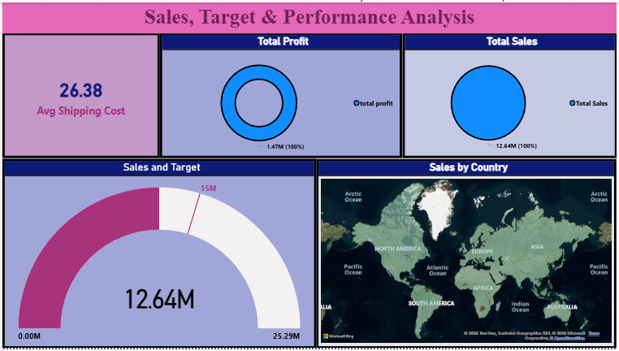

# Sales, Target & Performance Analysis Dashboard | Power BI

## Overview

This project showcases an interactive Power BI dashboard designed to analyze sales performance, targets, profitability, and shipping costs across different countries and regions.

The dashboard helps businesses track KPIs, compare actual sales with targets, and gain strategic insights through visually engaging analytics.

---

## Dashboard Preview

---

## Key Metrics

- Total Sales: 12.64M
- Total Profit: 1.47M
- Average Shipping Cost: 26.38
- Sales Target: 25.29M

---

## Features

- KPI cards for performance tracking
- Sales vs Target analysis
- Profit monitoring dashboard
- Country-wise sales visualization
- Interactive and dynamic reports
- Business performance analytics

---

## Tools & Technologies Used

- Power BI
- DAX
- Power Query
- Data Analytics
- Business Intelligence
- Data Visualization

---

## Business Insights

- Current sales achieved 12.64M against the target benchmark.
- Profit analysis indicates strong business performance.
- Shipping costs remain controlled and optimized.
- Global sales distribution provides regional business visibility.

---

## Files Included

| File | Description |
|------|-------------|
| `.pbix` | Power BI Dashboard File |
| `Dataset` | Dataset used for analysis |
| `Screenshots` | Dashboard preview images |
| `README.md` | Project documentation |

---

## Project Objective

To develop a business intelligence dashboard capable of tracking organizational sales performance, target achievement, and profitability using interactive Power BI visualizations.

---

## Author

Sejal Sahu
